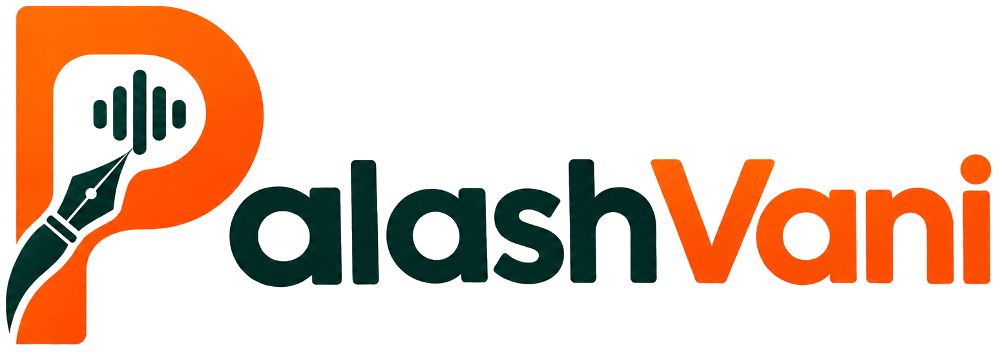
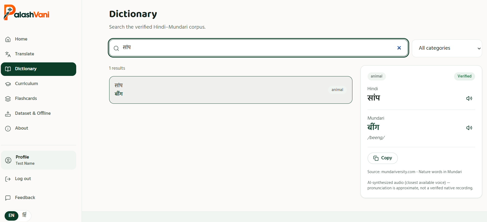
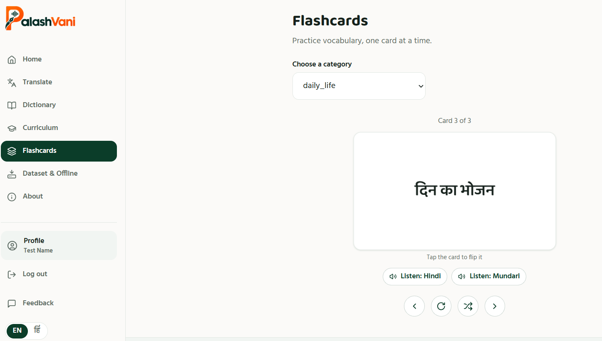
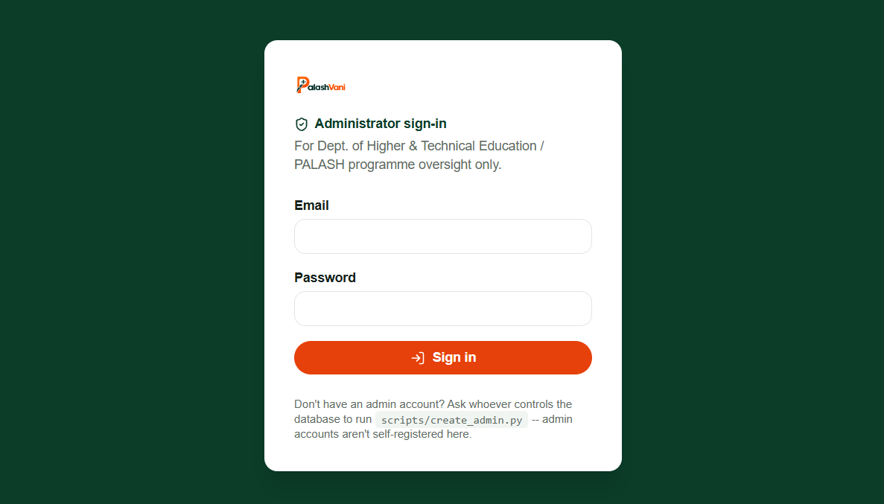
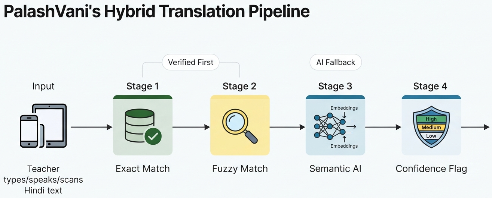
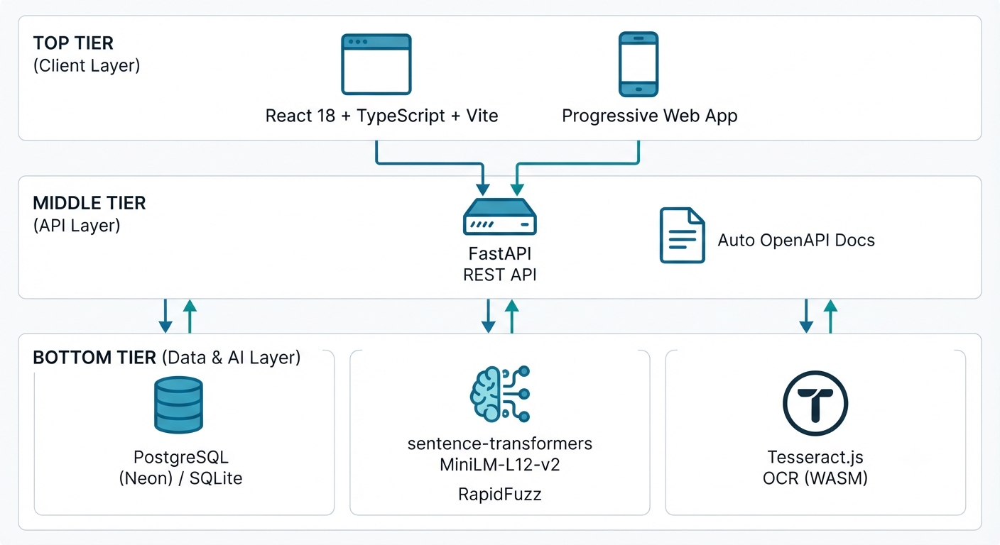
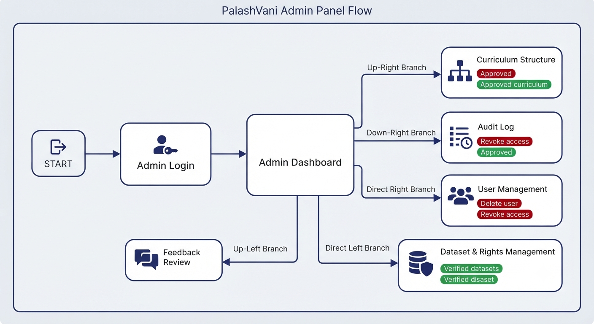
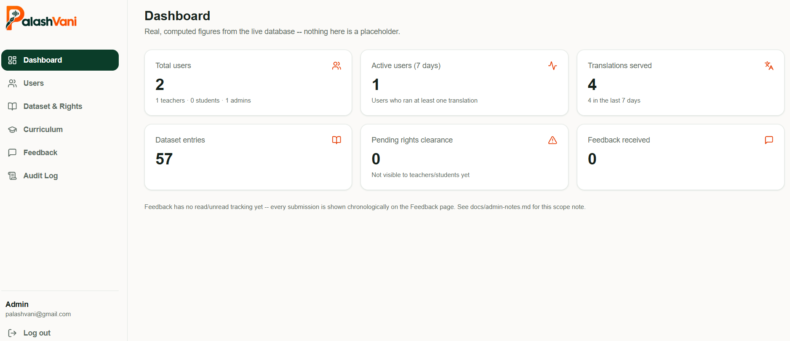
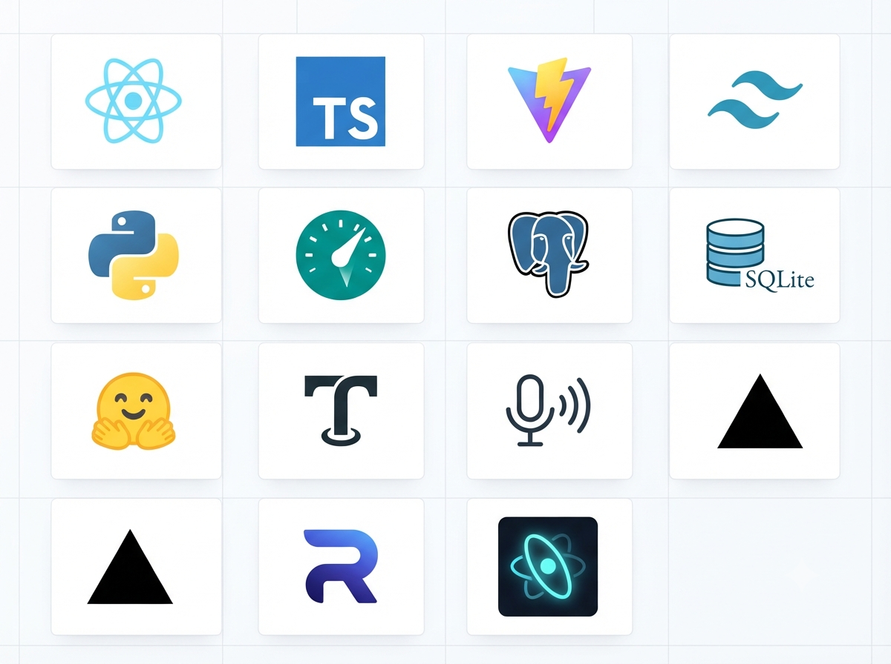

<div align="center">



### Hindi → Mundari translation and mother-tongue classroom companion
**Built for Smart India Hackathon 2026 — Problem Statement SIH26042**

[](#-license)


-0B3D29?style=flat-square&logo=postgresql&logoColor=white)


**[🌐 Live App](https://palashvani-sih26042.vercel.app/) · [⚙️ API](https://palashvani-sih26042-backend.onrender.com/docs) · [📦 Repository](https://github.com/Oliveya-15/PalashVani-SIH26042)**

</div>

<br/>

> *"A certificate proves you registered. It doesn't prove you can build. This does."*

<br/>

## 📑 Table of Contents

- [📖 The Story Behind PalashVani](#-the-story-behind-palashvani)
- [🎯 The Problem Statement](#-the-problem-statement)
- [✨ What PalashVani Does](#-what-palashvani-does)
- [🖼️ Screenshots](#️-screenshots)
- [🧠 How the Translation AI Works](#-how-the-translation-ai-works)
- [🏗️ Architecture & User Flow](#️-architecture--user-flow)
- [🔐 Admin Panel](#-admin-panel)
- [🛠️ Tech Stack](#️-tech-stack)
- [🚀 Live Demo](#-live-demo)
- [⚡ Getting Started](#-getting-started)
- [📁 Project Structure](#-project-structure)
- [📊 Presentation](#-presentation)
- [🗺️ Roadmap](#️-roadmap)
- [📜 Dataset & Licensing](#-dataset--licensing)
- [📄 License](#-license)
- [🙏 Acknowledgments](#-acknowledgments)

<br/>

---

## 📖 The Story Behind PalashVani

*This README doesn't start with installation steps; it starts with a story worth reading.*

### Round One: The Poster I Was Too Late For

I did my undergraduate degree (BCA, 2022–25) at a tier-three college, in a batch where "hackathon" wasn't really part of the vocabulary yet — not because nobody was interested, just because the information rarely reached us first. In my final year, I spotted a hackathon poster near the main building on an otherwise ordinary day. The event was already underway, the deadline days out, and my department hadn't heard a word about it. By the time I understood what I was looking at, it was too late to enter.

Not long after, I left that college for a new city and a master's program — a move that still comes with a pinch of nostalgia, since that campus holds a lot of good memories. New city, new people, a version of myself that wasn't naturally built for walking into rooms and making friends on day one. It took time to settle in. It always does. It also, eventually, worked.

### Round Two: Building From Scratch, On Purpose

Then came MCA, and with it, Smart India Hackathon — problem statement SIH26042. This time, I wasn't going to let logistics beat me to it.

I put together a team, and from day one I was the one researching the problem statement, drafting the pitch, and obsessing over slide design (perfectionist tendencies, fully on display). Our mentor reviewed the presentation and liked it. So did everyone else who saw it.

Then came a scheduling mix-up — the kind every group project eventually runs into. A registration form got crossed with another one, a confirmation got lost in the scroll of a very active group chat, and by the time the mistake surfaced, the internal round's dates had already been set — without us in the loop. Weeks of preparation, technically homeless.

### The Night It Nearly Fell Apart

I won't pretend that part didn't sting. In our team chat that night, I said, plainly, that I was stepping back from it — the kind of thing that reads harsher over text than it's meant to. For a moment, I worried I'd damaged more than just our shot at the hackathon.

I hadn't. A day later, a teammate pulled me out to visit a place we'd planned to see together before hackathon prep took over our schedules — the same day the internal round was happening without us. We went anyway. It was good. We still are.

Around the same time, my older brother — a few years into his own career, and someone I've always leaned on for a straight, steady opinion — told me it genuinely didn't matter, that something better was on its way, and the only job left was to keep going. I believed him. I still do.

We later heard the internal round itself ran long and a little chaotically for the teams that did make it. It didn't change our outcome. It did put things in perspective.

### The Real Finish Line

Here's the part I'm actually proud of: **I never stopped building.**

No internal round, no certificate, no login ID to prove any of it — and the work continued anyway. I took the project from research through design through deployment on my own: frontend on Vercel, backend on Render, database on Neon PostgreSQL. I'm still refining it, still adding to it, well past the point where it would have "counted" for anything official.

This repository, **PalashVani**, is that project — built for SIH26042, minus the paperwork, plus everything that actually matters: the problem research, the design decisions, the late nights, a working, deployed product.

Participation alone was never really the point. A certificate proves you registered. It doesn't prove you can build. **This does.**

<br/>

---

## 🎯 The Problem Statement

<table>
<tr><td><strong>Problem Statement ID</strong></td><td>26042</td></tr>
<tr><td><strong>Title</strong></td><td>AI-Powered Vernacular Pedagogy and Real-Time Translation Tool for Mother Tongue-Based Primary Education</td></tr>
<tr><td><strong>Organization</strong></td><td>Government of Jharkhand</td></tr>
<tr><td><strong>Department</strong></td><td>Department of Higher &amp; Technical Education</td></tr>
<tr><td><strong>Category</strong></td><td>Software</td></tr>
<tr><td><strong>Theme</strong></td><td>Smart Education</td></tr>
</table>

### Background

Jharkhand's **PALASH** Mother Tongue-Based Multilingual Education (MTB-MLE) programme has demonstrated measurable improvements in foundational literacy among tribal children. But scaling it is bottlenecked by a shortage of teachers proficient in tribal languages — **Ho, Mundari, and Santali** — languages with limited digital NLP resources. Most teachers posted to tribal-area primary schools are Hindi-medium trained and lack the linguistic tools to deliver mother-tongue instruction.

Without a technology bridge, over **5,000 tribal-area primary schools** continue to teach in a language their students don't speak at home.

| | |
|---|---|
| 🏫 **1,041+** | PALASH schools live |
| 🗺️ **6** | districts in Jharkhand |
| 🌐 **5** | tribal languages in scope |
| 🎓 **1–5** | target grade range |

**PalashVani's answer:** let a teacher type, speak, or scan a page of Hindi text and get a Mundari result instantly — sourced from a verified dictionary first, AI-assisted only when necessary, and never a silent guess.

<br/>

---

## ✨ What PalashVani Does

<p align="center"></p>

- 🔤 **Verified-first hybrid translation** — normalize → exact match → fuzzy match → optional AI semantic match → an honest "no match" when nothing qualifies. Never a fabricated answer.
- 📷 **Scan & Translate** — point a camera at a Hindi textbook page; on-device OCR (Tesseract.js) extracts the text, zero server upload, zero paid API.
- 🎙️ **Voice input & text-to-speech** — browser-native Web Speech API, with honest "not supported here" states instead of a fake mic animation.
- 📖 **Searchable dictionary** — click any word for a full detail panel: translation, transliteration, source citation, and independent Hindi/Mundari playback.
- 🎓 **Curriculum browser** — the same verified phrases organised by Grade → Subject → Chapter for lesson planning.
- 🗂️ **Flashcards** — flip-card vocabulary practice, by category.
- 📶 **Offline content packs** — download a category once, keep using it with no connectivity, backed by the browser's Cache API — plus a real downloadable file, not just an invisible cache update.
- 🌓 **Bilingual UI** — complete English/Hindi interface.
- 🔒 **Login required, role-aware** — every learning feature requires an account; teachers get lesson-prep tools (like offline packs) that students don't.

<br/>

---

## 🖼️ Screenshots

<table>
<tr>
<td width="50%"><p align="center"><sub><strong>Translate</strong> — type, speak, or scan, with method &amp; confidence shown for every result</sub></p></td>
<td width="50%"><p align="center"><sub><strong>Dictionary</strong> — searchable corpus with a full word-detail panel</sub></p></td>
</tr>
<tr>
<td width="50%"><p align="center"><sub><strong>Flashcards</strong> — practice vocabulary with independent Hindi/Mundari audio</sub></p></td>
<td width="50%"><p align="center"><sub><strong>Admin Panel</strong> — users, dataset rights, and activity oversight</sub></p></td>
</tr>
</table>

<br/>

---

## 🧠 How the Translation AI Works

<p align="center"></p>

Every translation walks a six-stage pipeline and stops at the first stage confident enough to answer:

| # | Stage | What it is |
|---|---|---|
| 1 | **Normalize** | Unicode cleanup, punctuation/whitespace handling — deterministic, auditable |
| 2 | **Exact match** | Direct hit against the verified, citation-backed corpus → **High confidence** |
| 3 | **Fuzzy match** | Typo/spacing-tolerant matching (`rapidfuzz`) → **Medium confidence** |
| 4 | **Semantic match** | Real AI: multilingual sentence-embedding model (MiniLM) catches paraphrases → flagged **AI-assisted** |
| 5 | **External fallback** | Optional, disabled by default (Bhashini) — never required to run the app |
| 6 | **Honest "no match"** | If nothing clears the bar, PalashVani says so — it never guesses |

Every result tells the teacher *exactly* how it was produced. That confidence flag is the whole point: this is a tool built for a classroom, where a wrong answer presented as right is worse than no answer at all.

<br/>

---

## 🏗️ Architecture & User Flow

<p align="center"></p>

<p align="center"></p>

Three independently deployed apps, one shared API:

| App | Stack | Hosted on | Used by |
|---|---|---|---|
| `frontend/` | React + Vite | Vercel | Teachers & students |
| `admin/` | React + Vite | Vercel *(separate project)* | Admins only |
| `backend/` | FastAPI | Render | Serves both apps via REST |
| — | PostgreSQL | Neon *(serverless)* | Shared by the backend |

Both frontend apps talk to the same FastAPI backend over REST; the backend is the only thing that touches the database. Keeping the admin surface as its own deployed app — rather than hidden routes inside the main frontend — means a bug in the dashboard can never take down the app a teacher is using mid-lesson, and it never ships extra weight to the low-end devices the student/teacher app is optimized for.

<br/>

---

## 🔐 Admin Panel

<p align="center"></p>

A separate, role-gated app for the governance a real government-backed platform needs:

- **📊 Dashboard** — live user/translation/feedback counts, nothing fabricated
- **👥 Users** — manage teacher, student, and admin accounts; activate, deactivate, reassign roles
- **📚 Dataset & Rights** — every dictionary entry, with a **copyright-clearance workflow**: new entries start unpublished and stay invisible to the public app until an admin reviews the source citation and explicitly clears rights
- **🎓 Curriculum** — manage the Grade → Subject → Chapter structure
- **💬 Feedback** — every submission, attributed to the account that sent it
- **📜 Audit Log** — every admin action, permanently recorded — "who changed what, and when" is always answerable

Admin accounts are **never self-registered** through the public form — they're provisioned directly against the database, the way a real institutional system should work.

<br/>

---

## 🛠️ Tech Stack

<p align="center"></p>

<table>
<tr><th>Layer</th><th>Technology</th></tr>
<tr><td>Frontend &amp; Admin</td><td>React · TypeScript · Vite · Tailwind CSS · TanStack Query · React Router</td></tr>
<tr><td>Backend</td><td>Python · FastAPI · Pydantic · SQLAlchemy</td></tr>
<tr><td>Database</td><td>PostgreSQL (Neon, serverless) · Alembic migrations</td></tr>
<tr><td>Auth</td><td>JWT (PyJWT) · bcrypt password hashing · role-based access control</td></tr>
<tr><td>AI / NLP</td><td>sentence-transformers (MiniLM) · rapidfuzz</td></tr>
<tr><td>OCR &amp; Voice</td><td>Tesseract.js (in-browser OCR) · Web Speech API (voice input &amp; TTS)</td></tr>
<tr><td>Deployment</td><td>Vercel (frontend + admin) · Render (backend) · Neon (database)</td></tr>
</table>

Every one of these choices is deliberate and documented — see `docs/architecture.md`, `docs/ai-pipeline.md`, and `docs/admin-notes.md` for the reasoning behind each.

<br/>

---

## 🚀 Live Demo

| | |
|---|---|
| 🌐 **App** | [palashvani-sih26042.vercel.app](https://palashvani-sih26042.vercel.app/) |
| ⚙️ **API docs** | [palashvani-sih26042-backend.onrender.com/docs](https://palashvani-sih26042-backend.onrender.com/docs) |
| 📦 **Source** | [github.com/Oliveya-15/PalashVani-SIH26042](https://github.com/Oliveya-15/PalashVani-SIH26042) |

> ⏳ The backend is on Render's free tier — the first request after a period of inactivity can take 30–60 seconds to spin back up. That's infrastructure, not a bug.

<br/>

---

## ⚡ Getting Started

```bash
# 1. Clone
git clone https://github.com/Oliveya-15/PalashVani-SIH26042.git
cd PalashVani-SIH26042

# 2. Backend
cd backend
python -m venv .venv && .venv\Scripts\Activate.ps1   # Windows
pip install -r requirements.txt
alembic upgrade head
python ../scripts/seed_reference_data.py
python ../scripts/import_dataset.py ../data/raw/hindi_mundari_seed.csv --target mundari
uvicorn app.main:app --reload --port 8000

# 3. Frontend (new terminal)
cd frontend
npm install && npm run dev        # → http://localhost:5173

# 4. Admin panel (new terminal, optional)
cd admin
npm install && npm run dev        # → http://localhost:5174
```

Full setup, environment variables, and troubleshooting: see `SETUP_INSTRUCTIONS.md`. Run the backend test suite with `pytest` from inside `backend/`.

<br/>

---

## 📁 Project Structure

```
PalashVani-SIH26042/
├── frontend/          React + TypeScript app — teachers & students
├── admin/             React + TypeScript app — admin panel (separate deploy)
├── backend/           FastAPI app, SQLAlchemy models, Alembic migrations
├── data/              Sourced seed dataset (raw/) + processed DB
├── scripts/           Dataset import, reference-data seeding, admin creation
├── docs/              Architecture, AI pipeline, database, auth, admin notes
├── public/            README assets (this file's images)
└── SETUP_INSTRUCTIONS.md
```

<br/>

---

## 📊 Presentation

<p align="center"></p>

<p align="center"><a href="public/PalashVani_SIH26042.pptx">📥 Download the full presentation deck (.pptx)</a></p>

<br/>

---

## 🗺️ Roadmap

- [ ] Ho and Santali language support (architecture already supports it — just needs a sourced corpus)
- [ ] A larger, formally-licensed Hindi–Mundari corpus via JCERT/PALASH partnership
- [ ] Fine-tuned neural translation model for Mundari specifically
- [ ] Offline, on-device speech synthesis
- [ ] Full installable PWA with background sync
- [ ] Bulk CSV import UI inside the admin panel

<br/>

---

## 📜 Dataset & Licensing

The seed corpus is a small, **hand-sourced and citation-backed** set of Hindi–Mundari pairs — every single row traceable to its source, never fabricated. Primary sources:

- [Omniglot.com](https://omniglot.com) — Numbers in Mundari
- [mundariversity.com](https://mundariversity.com) — Mundari–Hindi–English vocabulary & conversation lessons

New entries added through the admin panel stay **unpublished until rights are explicitly cleared** — see [Admin Panel](#-admin-panel). Full sourcing notes: `data/README.md`.

<br/>

---

## 📄 License

Code licensed under [MIT](LICENSE). The seed dataset carries its own, separate sourcing note — see `data/README.md` — since it isn't original work.

<br/>

## 🙏 Acknowledgments

- **Government of Jharkhand, Dept. of Higher & Technical Education** — for defining a problem statement worth solving
- **PALASH programme** — the mother-tongue education initiative this project supports
- The mentor who reviewed the original pitch and believed in it
- The teammate, and the brother, from the story above

<br/>

<div align="center">

**Built solo, end to end — research, design, code, and deployment.**

<sub>PalashVani · SIH26042 · 2026</sub>

</div>
