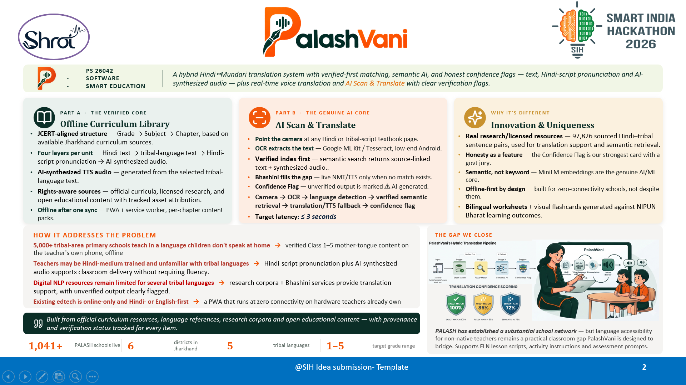
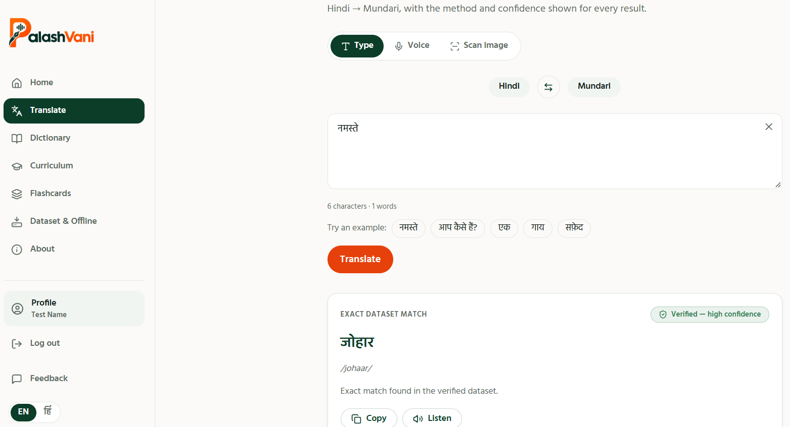

<div align="center">


# **PalashVani**
### *Hindi ↔ Mundari Translation System for Mother Tongue-Based Primary Education*

[](https://sih.gov.in)
[](https://sih.gov.in/sih2026PS)
[](https://palashvani-sih26042.vercel.app/)
[](https://github.com/Oliveya-15/PalashVani-SIH26042)

**Built for Jharkhand's PALASH Programme • 1,041+ Schools • 5,000+ Addressable**

[🚀 Live Demo](https://palashvani-sih26042.vercel.app/) • [🔐 Admin Panel](https://palashvani-sih26042-admin.vercel.app/) • [📖 Documentation](docs/) • [💬 Feedback](#feedback)

</div>

---

## 📖 **The Story Behind PalashVani**

> *This README doesn't start with installation steps; it starts with a story worth reading.*

### **Round One: The Poster I Was Too Late For**

I did my undergraduate degree (BCA, 2022–25) at a tier-three college, in a batch where "hackathon" wasn't really part of the vocabulary yet — not because nobody was interested, just because the information rarely reached us first. In my final year, I spotted a hackathon poster near the main building on an otherwise ordinary day. The event was already underway, the deadline days out, and my department hadn't heard a word about it. By the time I understood what I was looking at, it was too late to enter.

Not long after, I left that college for a new city and a master's program — a move that still comes with a pinch of nostalgia, since that campus holds a lot of good memories. New city, new people, a version of myself that wasn't naturally built for walking into rooms and making friends on day one. It took time to settle in. It always does. It also, eventually, worked.

### **Round Two: Building From Scratch, On Purpose**

Then came MCA, and with it, Smart India Hackathon — problem statement **SIH26042**. This time, I wasn't going to let logistics beat me to it.

I put together a team, and from day one I was the one researching the problem statement, drafting the pitch, and obsessing over slide design (perfectionist tendencies, fully on display). Our mentor reviewed the presentation and liked it. So did everyone else who saw it.

Then came a scheduling mix-up — the kind every group project eventually runs into. A registration form got crossed with another one, a confirmation got lost in the scroll of a very active group chat, and by the time the mistake surfaced, the internal round's dates had already been set — without us in the loop. Weeks of preparation, technically homeless.

### **The Night It Nearly Fell Apart**

I won't pretend that part didn't sting. In our team chat that night, I said, plainly, that I was stepping back from it — the kind of thing that reads harsher over text than it's meant to. For a moment, I worried I'd damaged more than just our shot at the hackathon.

I hadn't. A day later, a teammate pulled me out to visit a place we'd planned to see together before hackathon prep took over our schedules — the same day the internal round was happening without us. We went anyway. It was good. We still are.

Around the same time, my older brother — a few years into his own career, and someone I've always leaned on for a straight, steady opinion — told me it genuinely didn't matter, that something better was on its way, and the only job left was to keep going. I believed him. I still do.

We later heard the internal round itself ran long and a little chaotically for the teams that did make it. It didn't change our outcome. It did put things in perspective.

### **The Real Finish Line**

Here's the part I'm actually proud of: **I never stopped building.**

No internal round, no certificate, no login ID to prove any of it — and the work continued anyway. I took the project from research through design through deployment on my own: frontend on **Vercel**, backend on **Render**, database on **Neon PostgreSQL**. I'm still refining it, still adding to it, well past the point where it would have "counted" for anything official.

This repository, **PalashVani**, is that project — built for SIH26042, minus the paperwork, plus everything that actually matters: the problem research, the design decisions, the late nights, **a working, deployed product.**

**Participation alone was never really the point.** A certificate proves you registered. It doesn't prove you can build. **This does.**

---

<div align="center">

## 🎯 **What is PalashVani?**

</div>

**PalashVani** is a **hybrid Hindi ↔ Mundari translation system** designed to bridge the language gap in Jharkhand's tribal-area primary schools, where over **5,000 schools** teach in a language many children don't speak at home, and Hindi-medium trained teachers often lack fluency in Ho, Mundari, or Santali.

### **The Problem (SIH26042)**

- **5,000+ tribal-area primary schools** in Jharkhand face a critical language barrier
- Teachers are Hindi-medium trained, unfamiliar with tribal languages
- Students receive instruction in a language they don't comprehend at home
- Digital NLP resources for Ho, Mundari, and Santali remain severely limited
- Existing edtech solutions are online-only and Hindi/English-first

### **Our Solution**

A **verified-first, offline-capable translation system** that:
- ✅ Prioritizes **verified corpus matches** over AI guessing
- ✅ Uses **semantic AI (MiniLM-L12-v2)** as fallback, not first resort
- ✅ Shows **honest confidence scores** — never silently guesses
- ✅ Works **offline** after initial sync
- ✅ Includes **admin panel** for content management with rights-clearance workflow
- ✅ Features **client-side OCR** (Tesseract.js) and **browser-native voice I/O**
- ✅ Built with **zero paid dependencies** — fully open source

---

<div align="center">

## 🖼️ **Visual Overview**

</div>

<table>
<tr>
<td width="50%">

### 📊 **Live Presentation**

*Smart India Hackathon 2026 Submission*

[📥 Download Full PPT](PalashVani_SIH26042.pptx)

</td>
<td width="50%">

### 💻 **Live Application**

*Translation interface with confidence scoring*

[🚀 Try Live Demo →](https://palashvani-sih26042.vercel.app/)

</td>
</tr>
</table>

---

<div align="center">

## 🏗️ **System Architecture**

</div>


### **Three-Tier Architecture**

<table>
<tr>
<th width="33%">🖥️ Client Layer</th>
<th width="33%">⚙️ API Layer</th>
<th width="34%">💾 Data & AI Layer</th>
</tr>
<tr>
<td valign="top">

**Frontend**
- React 18 + TypeScript
- Vite build tool
- Tailwind CSS
- TanStack Query
- React Router v6

**Client-Side**
- Tesseract.js OCR (WASM)
- Web Speech API
- Progressive Web App
- Offline-ready

</td>
<td valign="top">

**Backend**
- Python 3.11+
- FastAPI (async)
- JWT Authentication
- RBAC (Role-Based Access)
- Alembic Migrations
- Auto OpenAPI Docs
- Rate Limiting

</td>
<td valign="top">

**Database**
- PostgreSQL (Neon.tech)
- SQLite (development)
- 57-row seed corpus
- Admin-managed expansion

**AI/ML**
- sentence-transformers
- MiniLM-L12-v2
- RapidFuzz (fuzzy match)
- CPU-only (no GPU)

</td>
</tr>
</table>

---

<div align="center">

## 🔄 **Translation Pipeline: Verified-First Approach**

</div>


### **Four-Stage Hybrid Pipeline**

```mermaid
graph LR
    A[Input<br/>Type/Speak/Scan] --> B[Stage 1:<br/>Exact Match<br/>100%]
    B -->|No match?| C[Stage 2:<br/>Fuzzy Match<br/>70-99%]
    C -->|Still no?| D[Stage 3:<br/>Semantic AI<br/>Variable]
    D --> E[Stage 4:<br/>Confidence Flag<br/>Exact/Fuzzy/AI/None]
    
    style A fill:#E8F4F8
    style B fill:#2C5F2D,color:#fff
    style C fill:#F9E795
    style D fill:#065A82,color:#fff
    style E fill:#1E2761,color:#fff