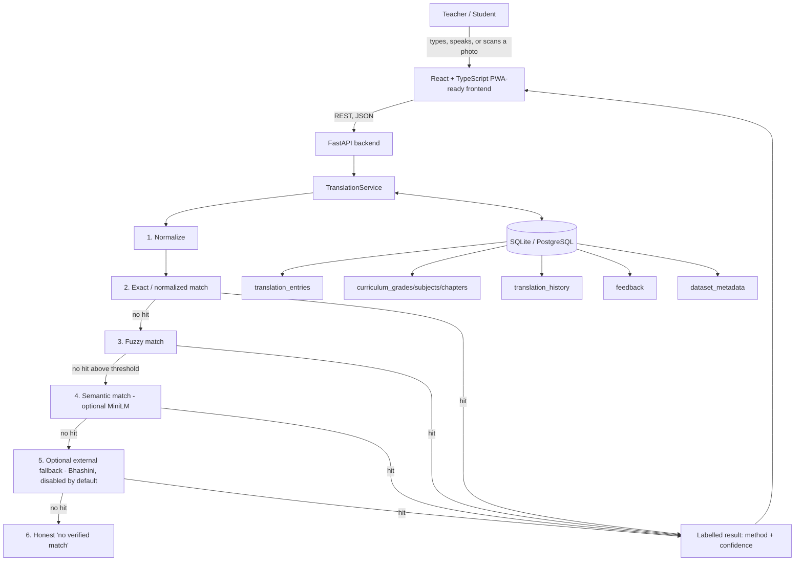

# Architecture

## System overview

This mirrors the SIH pitch's own architecture line -- *"content sources →
verified layer → AI processing → teacher app → offline device"* -- with one
adaptation: the pitch's mobile OCR/ASR calls (Google ML Kit / Bhashini) are
implemented here as **in-browser, zero-cost equivalents** (Tesseract.js for
OCR, the Web Speech API for ASR/TTS) so the entire core prototype runs with
no paid service and no API key, per the project's zero-cost requirement.
Bhashini itself is kept as a documented, disabled-by-default optional stage
(`backend/app/ai/bhashini_stub.py`) for exactly the live-NMT-fallback role
the pitch describes.

## Why this approach (decisions worth explaining in a viva)

**Why FastAPI over Django/Flask/Node?** FastAPI gives automatic OpenAPI
docs (`/docs`) for free, first-class async support, and Pydantic-based
request/response validation -- all three are direct, gradeable evidence of
"clean API design" without hand-writing a spec. It is also exactly what
the source PPT's own technical-approach slide names.

**Why a hybrid pipeline instead of one neural model?** A single seq2seq
translation model fine-tuned on ~50 sentence pairs would badly overfit and
produce confident-sounding nonsense on anything else -- worse than useless
for a tool whose entire pitch is *"never guess."* Layering cheap,
deterministic stages (normalize → exact → fuzzy) in front of a real
semantic model means the system is right whenever it *can* be right, and
honest whenever it can't -- see `docs/ai-pipeline.md`.

**Why SQLite by default, not PostgreSQL?** The PPT's own tech slide
specifies "SQLite/local database" for exactly this offline-classroom use
case: zero setup, a single file a teacher's laptop can back up by copying
it. SQLAlchemy's engine abstraction (`backend/app/database/session.py`)
means switching to PostgreSQL later is a one-line `DATABASE_URL` change,
not a rewrite -- see `docs/database.md`.

**Why is curriculum content stored as a link on `translation_entries`
rather than its own table?** A chapter's content *is* a subset of the
verified corpus, not different data -- storing it twice would let the two
copies drift out of sync. Reuse also means Search, Translate, Flashcards,
and Curriculum all cite exactly the same 57 sourced rows, so there is only
one place a correction ever needs to be made.

**Why is OCR and speech done in the browser, not the backend?** Tesseract.js
and the Web Speech API are free, need no server round-trip for the image
or audio itself, and directly satisfy "must work with no internet and no
API keys" for the OCR/voice-input steps specifically (the *translation*
step still needs the backend, since that's where the verified corpus
lives).

## Request flow: a single translation

1. Browser normalizes nothing itself -- it sends the raw typed/spoken/
   scanned Hindi text as-is to `POST /api/translations`.
2. FastAPI validates the request body against `TranslateRequest` (Pydantic).
3. `TranslationService.translate()` runs the six-stage pipeline described
   above and in `docs/ai-pipeline.md`, querying `translation_entries` for
   the selected language pair.
4. Every call is recorded to `translation_history` (method + confidence),
   which is what powers the real (non-fabricated) counts shown on the
   Dataset & Offline page.
5. The response -- result text, method, confidence, message, alternatives --
   is rendered by `TranslationCard.tsx`, which never shows a result without
   also showing how it was produced.
